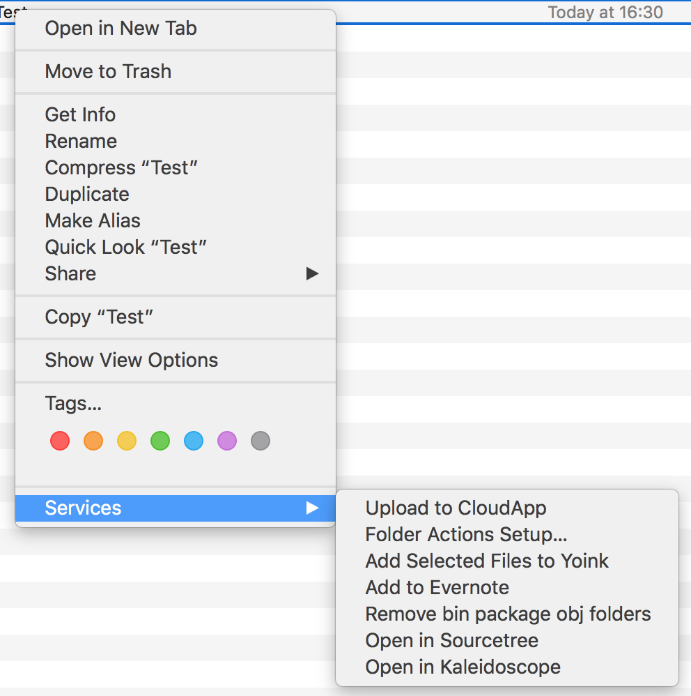

A Mac OSX Workflow to delete the bin, obj and packages folders

This work flow will delete the bin, obj and packages folders from your Xamarin projects. This should shave a ton of space when you have alot of projects.

## How to install:
Double click on `Remove bin package obj folders.workflow` this should ask you to install the workflow. 
Now you should be able right click on a folder and select `Services` > `Remove bin package obj folders`



Example of Projects before cleaning


After cleaning


Script in workflow file:
```
#!/bin/bash
if [ -z $1 ] ; then
    exit 1
else
    #Finds all directories that have the name "bin", "obj" or "packages" then deletes them.
    find "$1" -type d \( -name bin -o -name packages -o -name obj \) -exec rm -rf {} +
fi
```

Inspired from http://www.joesauve.com/remove-obj-and-bin-folders-via-os-x-finder/
